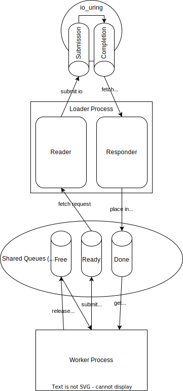

# Asynchronous File Loader

Python asynchronous file loader module implemented in C/CPython.

## Installation

### Requirements

* Install liburing (follow the instructions at https://github.com/axboe/liburing).
* Ensure kernel is sufficently up-to-date for liburing (check version with `uname -r`). The following demonstrates how to update your kernel for Ubuntu.
  * Choose a version from https://kernel.ubuntu.com/~kernel-ppa/mainline/.
  * Download the `.deb` files for the version you'd like to install.
  * Run `sudo dpkg -i *.deb` (ensuring there are no other `.deb` files in the download directory) and then `sudo apt -f install`.
  * Rebooting (`sudo reboot`) should bring the machine up with the newer kernel version, which can again be verified by running `uname -r`.\
  *Failure will result in an error similar to "`asynchronous read failed; Invalid argument`" when running the tests*\
  *Versions 5.16 and 6.4 have worked successfully, and 5.4 has failed*

### Manual

```python setup.py install```

*Note: you may need to `chown` the created build folder for proper permissions.*

### Testing

There are two tests in `test/` you can run to ensure the installation in working.
  * Test independent of Python wrapper (`test/c/async/`).
    * Make the test (`make`).
    * Run the test (`./async`).\
    *this test is very brief.*
  * Test of Python wrapper (`test/python/`).
    * Choose a directory to be loaded. The duration of the test will depend on the size of this directory, since all files contained will be loaded (e.g., `dir="~/data/"`).
    * Choose the type of file extension you want to load (e.g., `ext="JPEG"`).
    * Run the Python script (`python test.py $dir $ext`).\
    *this test may take a while.*


## Documentation

### `AsyncLoader.Loader(queue_depth: int, max_file_size: int, n_workers: int, dispatch_n: int, idle_iters: int, direct: Optional[bool])`

Loader, responsible for handling up to `queue_depth` concurrent requests
per worker, with up to `n_workers` workers. For the requests to issue, a minimum
of `dispatch_n` requests must be queued, or the reader loop must idle for
`max_idle_iters` without receiving any new requests.

The `direct` flag enables the `O_DIRECT` file flag, meaning that all IO bypasses
the page cache.

#### `Loader.become_loader()`

Causes this process to be used as the loader, spawning the loader and responder
threads. Does not return.

#### `Loader.spawn_loader()`

Causes this process to fork, with the child becoming the loader process.
Equivilent to spawning a new process and calling `become_loader()`.

#### `Loader.get_worker_context(id: int) -> AsyncLoader.Worker`

Returns the `AsyncLoader.Worker` context for the given worked id.

### `AsyncLoader.Worker`

Worker context. Provides an interface to the loader for the given worker.

#### `Worker.request(filepath: str) -> bool`

Request a filepath to be loaded. Returns `True` on success, `False` on failure.

#### `Worker.try_get() -> AsyncLoader.Entry`

Attempt to fetch an entry from the completion queue. If an entry is available,
returns an `AsyncLoader.Entry`. If no entry is available, `None` is returned.

#### `Worker.wait_get() -> AsyncLoader.Entry`

Spin on `try_get()` until an entry is returned.

### `AsyncLoader.Entry`

Entry class. Returned by `try_get` and `wait_get` methods, containing file data
for the requested IO. Once the data has been used, the entry should be released
by calling `Entry.Release()`, otherwise the loader will run out of entries.

#### `Entry.get_filepath() -> str`

Return the filepath that was loaded for this entry.

#### `Entry.get_data() -> bytes`

Returns the contained filedata as `bytes`.

#### `Entry.release()`

Releases the entry. Should always be called once `get_data()` has been called
for the final time. Failure to release entries will eventually prevent new
requests from being submitted, as no entries will be free to house them.


## Diagram

<p align="center">
    
</p>